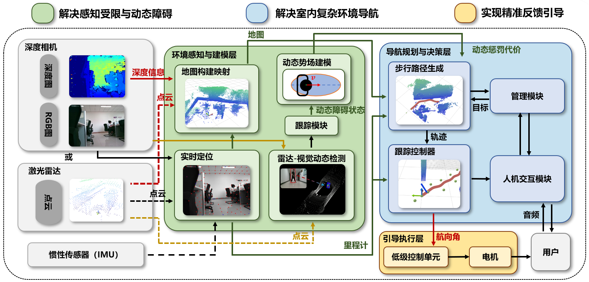
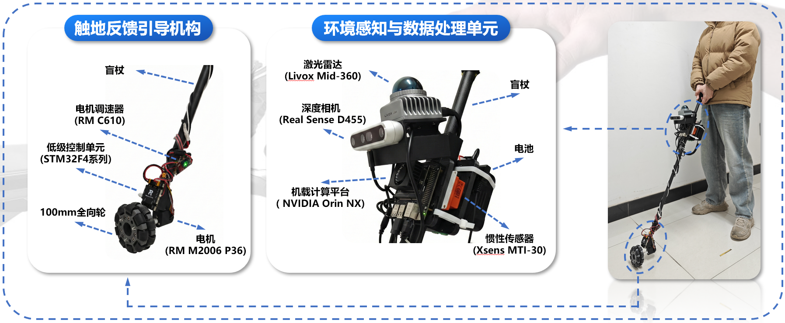
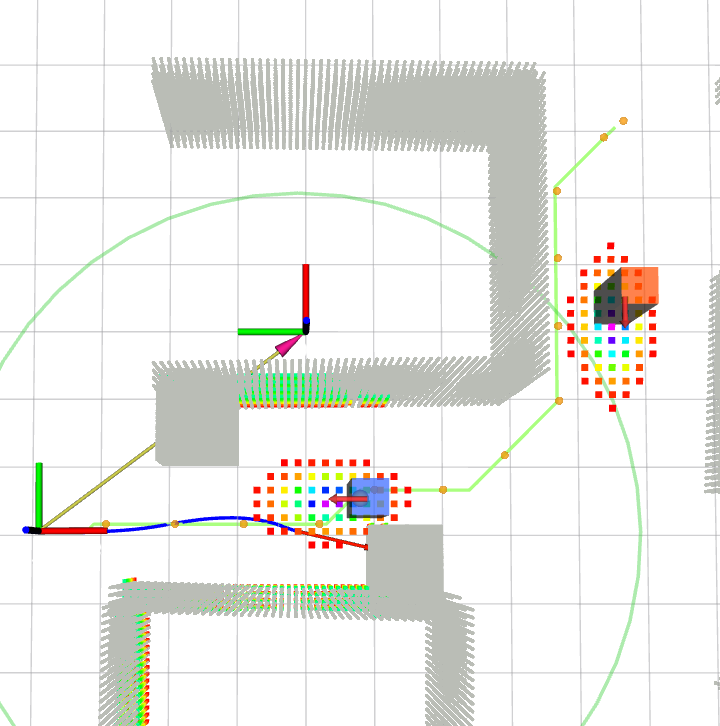
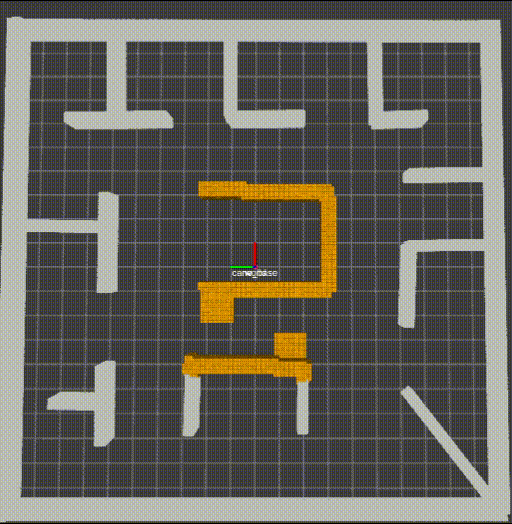
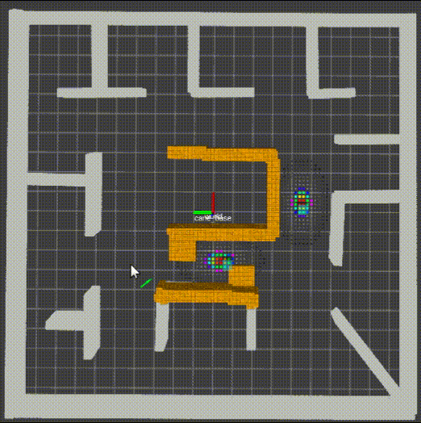
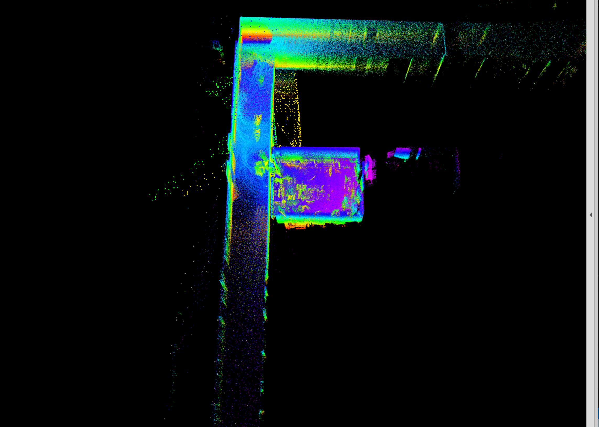
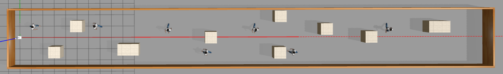
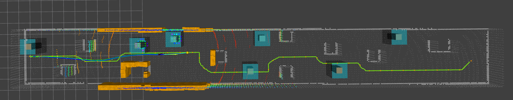
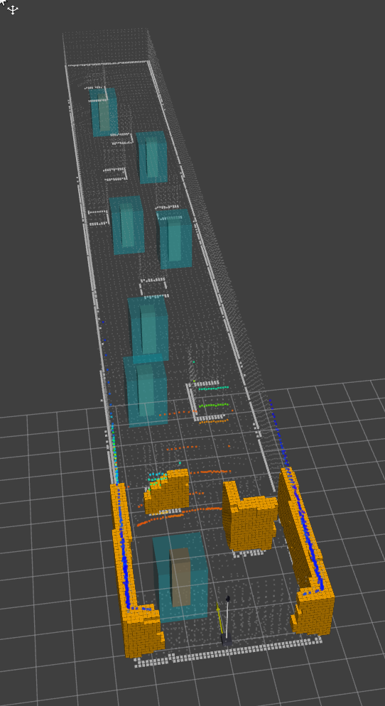
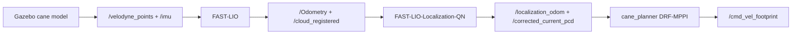

# Cane Planner

`cane_planner` is the ROS1 Noetic navigation stack for a smart-cane guidance
system. It combines global path planning, pedestrian-aware MPPI local planning,
local ESDF collision checking, and steering control for lightweight simulation,
Gazebo simulation, and real hardware.



## Highlights

- Smart-cane navigation for visually impaired guidance.
- Global planning with A* or Kinodynamic A*.
- Local pedestrian-aware planning with DRF-MPPI.
- Stop/yield advice for crossing pedestrian conflicts.
- Lightweight simulation, Gazebo relocalization simulation, and hardware entry
  points.
- ROS integration with FAST-LIO / FAST-LIO-Localization and LV-DOT dynamic
  obstacle tracking.

The cane is underactuated: the user provides forward walking motion, while the
system mainly shapes heading and local path guidance.

## Gallery



Current hardware platform with LiDAR, depth camera, onboard compute, controller,
power, and steering/wheel guidance components.



RViz view of the planner, local map, dynamic obstacle markers, waypoint, and MPC
trajectory.



Crossing-pedestrian behavior with DRF-MPPI and stop/yield supervision.



Mixed pedestrian scene for checking dynamic-obstacle handling beyond a single
crossing case.



FAST-LIO / relocalization map output used by the navigation stack.



Gazebo corridor world with moving pedestrians and obstacle layout.



Gazebo + FAST-LIO relocalization + MPC path planning in RViz.



RViz detail view of registered cloud, local map, dynamic obstacles, and planner
markers.

## Stack

```text
odometry / localization + registered cloud
        -> plan_env local ESDF and collision layer
dynamic obstacle observations
        -> global A* waypoints
        -> DRF-MPPI local planner
        -> stop/yield advice and steering command
```

Main package areas:

```text
plan_manage/       launch files, PlannerManager FSM, simulation utilities
path_searching/    A*, KinodynamicAstar, MPPI, LFPC, DynamicRiskField
plan_env/          SDF map, collision checking, object prediction interface
bspline*/          B-spline trajectory representation and optimization
plan_ctrl*/        L1 control and hardware interfaces
omniGKF_ctrl/      omnidirectional wheel driver and custom messages
Utils/             map, waypoint, IMU, and motor utilities
LFPC/              Python walking-model reference prototype
```

Companion workspace packages:

- `FAST-LIO-SAM-QN`: LiDAR-inertial odometry and mapping.
- `FAST-LIO-Localization-QN`: map-based relocalization.
- `LV-DOT/onboard_detector`: dynamic obstacle detection and tracking.

## Build

Build from the workspace root:

```bash
cd /home/xcg/ws
source /opt/ros/noetic/setup.bash

catkin build nano_gicp -DCMAKE_BUILD_TYPE=Release
catkin build quatro -DCMAKE_BUILD_TYPE=Release -DQUATRO_TBB=ON -DQUATRO_DEBUG=OFF
catkin build -DCMAKE_BUILD_TYPE=Release

source devel/setup.bash
```

This workspace uses `catkin_tools` (`catkin build`), not `catkin_make`.

For planner-only development:

```bash
cd /home/xcg/ws
source /opt/ros/noetic/setup.bash
catkin build plan_manage path_searching -DCMAKE_BUILD_TYPE=Release
source devel/setup.bash
```

## Run

### Lightweight Simulation

```bash
cd /home/xcg/ws
source /opt/ros/noetic/setup.bash
source devel/setup.bash
roslaunch plan_manage sim_kin_replan.launch planner:=3
```

Planner modes:

```text
planner:=1  A*
planner:=2  KinodynamicAstar
planner:=3  DRF-MPPI
```

Use RViz `2D Nav Goal` to send a target. A pedestrian scenario can be enabled
with:

```bash
roslaunch plan_manage sim_kin_replan.launch \
  planner:=3 \
  use_pedestrians:=true \
  pedestrian_scenario:=crossing
```

### Gazebo Simulation With Relocalization

Terminal 1, Gazebo and planner:

```bash
cd /home/xcg/ws
source /opt/ros/noetic/setup.bash
source devel/setup.bash
roslaunch plan_manage gazebo_localization_mpc.launch \
  gui:=true \
  rviz:=true \
  start_teleop:=false
```

Terminal 2, FAST-LIO and relocalization:

```bash
cd /home/xcg/ws
source /opt/ros/noetic/setup.bash
source devel/setup.bash
roslaunch fast_lio_localization_qn sim_corridor_175_fastlio.launch rviz:=false
```

The Gazebo data flow is:



Use RViz `2D Nav Goal` after `/localization_odom` and
`/corrected_current_pcd` are publishing.

### Real Hardware

```bash
cd /home/xcg/ws
source /opt/ros/noetic/setup.bash
source devel/setup.bash
roslaunch plan_manage kin_replan.launch
```

Typical companion processes:

```bash
roslaunch fast_lio_sam_qn run.launch lidar:=ouster
roslaunch onboard_detector run_detector.launch
```

## Key Topics

Inputs:

```text
/localization_odom or /Odometry
/corrected_current_pcd or /cloud_registered
/onboard_detector/dynamic_obstacles_info
```

Planner and visualization outputs:

```text
/astar/path
/mpc/path
/mpc/current_waypoint
/mpc/waypoints
/mpc/best_traj
/mpc/stop_advice
/cmd_vel_footprint
```

The default RViz config is `plan_manage/config/replan.rviz`.

## Useful Files

```text
plan_manage/launch/sim_kin_replan.launch
plan_manage/launch/gazebo_localization_mpc.launch
plan_manage/launch/gazebo_mpc.launch
plan_manage/launch/kin_replan.launch
plan_manage/launch/include/algorithm.launch
plan_manage/config/replan.rviz
plan_manage/config/pedestrian_scenarios.yaml
plan_manage/scripts/gazebo_pedestrian_truth_bridge.py
path_searching/src/mpc_controller.cpp
path_searching/src/dynamic_risk_field.cpp
```

## Notes

- DRF-MPPI is a pedestrian-risk-aware planner, not a formal safety guarantee.
- Hardware topic names may differ by sensor setup and launch remaps.
- Older prototype notes are kept under `docs/archive/` and the project note
  files in this package.
